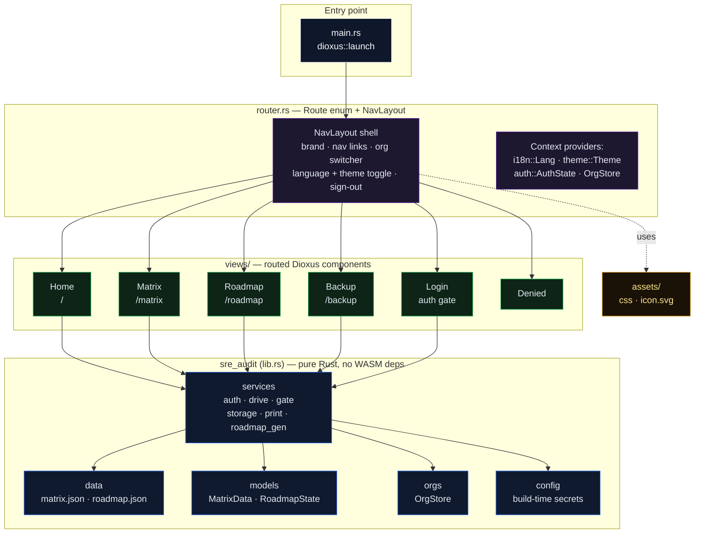

<p align="center">
  
</p>

<h1 align="center">SRE Audit</h1>

<p align="center">
  A maturity-matrix audit tool for SRE/ITIL practices — score an organisation across 7 principles,
  capture audit notes, and draft a short- and long-term reliability roadmap from the results.
</p>

<p align="center">
  <a href="https://github.com/StellaSecret/SRE-audit/actions/workflows/ci.yml"></a>
  
  
  
</p>

---

## What it does

SRE Audit walks an auditor through 7 SRE principles (Observability, SLO/SLI, Risk & Chaos,
Eliminating Toil, Automation, Release Engineering, Simplicity), each cross-mapped to an ITIL
process (Incident, Service Level, Problem, CSI, Service Request, Change, SACM). For every
principle you:

1. **Score the org** on a 4-level maturity scale (Reactive → Organised → Proactive →
   SRE/Continuous) in the **Matrix** view, with free-text audit notes per row.
2. Get a **draft Roadmap** auto-generated from that scoring — short-term (3-month) actions and
   a long-term (2–3 year) target vision — which you then refine with phased steps and KPIs.
3. **Back up** everything per organisation to Google Drive (`appDataFolder`), so audits aren't
   lost between sessions or devices.

Multiple organisations are supported side-by-side (`orgs.rs`), each with its own matrix,
roadmap, and Drive backup file. The UI is bilingual (FR/EN) and supports light/dark themes.

## Tech stack

- **[Dioxus](https://dioxuslabs.com/) 0.7** (Rust → WASM) for the UI, compiled to a static SPA
- **`dioxus-router`** for client-side routing
- **Google Identity Services (GIS)** OAuth2 for sign-in, gated by a build-time email allowlist
- **Google Drive API** (`drive.appdata` scope) for per-app, per-user backup
- **`gloo-storage`** for local persistence between sessions
- **Playwright** for end-to-end tests, **Cargo** unit tests for the pure-Rust core

## Architecture

The app is split into a **pure Rust core library** (`sre_audit`, no WASM/Dioxus dependencies —
runs and tests on any native host) and a **Dioxus binary** that renders routed views on top of
it.



Key design point: `services::roadmap_gen::fill_draft` only ever **writes into empty roadmap
cells** — it drafts the audit finding, next-level actions, and a generic 3-month target from
the matrix bank, but never overwrites text an auditor has already typed in. It's a scaffold to
fill in, not a generator of final content.

## Data model

- `src/data/matrix.json` — the 7×4 maturity bank (principle → level → badge + bullet items)
- `src/data/roadmap.json` — short-term (`st`) and long-term (`lt`) roadmap row definitions
- `MatrixState` / `RoadmapState` (`models.rs`) — per-organisation selections, comments, and
  roadmap cell text, persisted to `localStorage` and optionally backed up to Drive

## Getting started

### Prerequisites

- Rust (stable) with the `wasm32-unknown-unknown` target
- [Dioxus CLI](https://dioxuslabs.com/learn/0.7/getting_started) `0.7.9` (`dx`)
- Node.js (for the Playwright e2e suite)

### Run locally

```bash
# unit tests (pure Rust core, no WASM toolchain required)
cargo test

# check the binary compiles to WASM
cargo check --target wasm32-unknown-unknown --bin sre-audit

# serve the app locally with hot reload
dx serve --package sre-audit
```

Sign-in requires a `GOOGLE_CLIENT_ID` and `PREMIUM_EMAILS` (comma-separated allowlist) at build
time — see `src/config.rs`. Without them, the app builds but nobody can sign in.

### End-to-end tests

```bash
npm ci
npx playwright test
```

E2E builds set `SRE_AUDIT_E2E=1` to bypass the live Google re-verification round-trip and trust
a seeded session instead (see `services/auth.rs`); this flag must never be set in a production
build (CI guards against it — see below).

## CI/CD

`.github/workflows/ci.yml` runs on every push/PR to `main`:

1. **Secret scan** (TruffleHog, verified secrets only)
2. **Rust core** — `cargo test` + WASM compile check, plus **cargo-mutants** mutation tests on
   the pure-logic core (any survived mutant fails the build)
3. **Web build (e2e bundle)** — built with the e2e flag and a fixed test allowlist, then
   verified to actually contain the e2e marker
4. **Playwright e2e** — sharded across the e2e bundle
5. **Production build** — rebuilt with real secrets, *without* the e2e flag, then verified to
   **not** contain the e2e marker (fails the build otherwise — a safeguard against ever shipping
   a soft-gated bundle)
6. **Deploy** — publishes the production build to GitHub Pages on `main`

## Security notes

This is a static site with no backend: the email allowlist (`gate.rs`) is a **usability gate**,
not a security boundary — a determined user could bypass a client-side check. Google
Identity Services still verifies the email server-side on every sign-in, and the CI pipeline
guards against accidentally shipping the e2e bypass in production.

## License

MIT — see [`LICENSE`](LICENSE).
